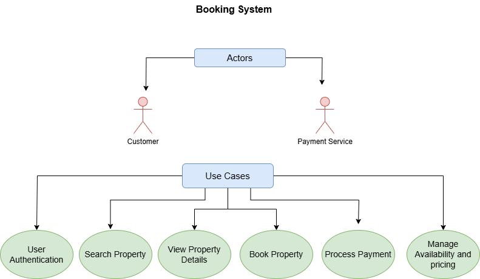

# Requirement Analysis in Software Development

## Introduction

This repository is dedicated to the **Requirement Analysis** phase of software development. It focuses on documenting, analyzing, and structuring the requirements for a **Booking Management System**. The goal of this repository is to provide a comprehensive foundation for software development by ensuring that all project needs are clearly defined, understood, and organized before moving on to the development phase. By participating in this project, learners will gain hands-on experience in creating and organizing requirements, use cases, and system documentation, all of which are crucial for the successful execution of any software project.

---

## What is Requirement Analysis?

Requirement Analysis is a crucial phase in the **Software Development Lifecycle (SDLC)**. It involves identifying and documenting the functional and non-functional requirements of a system or software project. This phase lays the groundwork for the entire project by ensuring that all stakeholders (clients, users, and development teams) are aligned on the project’s goals, functionality, and constraints.

### Key Activities in Requirement Analysis:
1. **Requirement Gathering**: Collecting information from stakeholders (clients, users, business analysts) about what they need the system to do. This may involve interviews, surveys, and reviewing existing systems.
2. **Functional Requirements**: Defining what the system must do—such as features, processes, data management, and interactions.
3. **Non-Functional Requirements**: Documenting how the system should behave, such as performance, security, scalability, and user accessibility.
4. **Use Cases and User Stories**: Creating detailed descriptions of how users will interact with the system to achieve specific goals.
5. **Acceptance Criteria**: Establishing clear criteria for when the system is considered "done" or when a specific feature is deemed complete.

### Importance of Requirement Analysis in the SDLC

1. **Clarifies Stakeholder Needs**: Requirement analysis helps identify the true needs of the stakeholders and ensures the software being developed will meet those needs. By understanding these requirements upfront, the development team can avoid misunderstandings and misaligned expectations later in the process.

2. **Prevents Scope Creep**: Clear and well-documented requirements help prevent scope creep, where additional features or changes are introduced after development begins. Proper requirement analysis helps define boundaries and ensures the project stays focused on what is essential.

3. **Reduces Development Costs and Time**: Identifying requirements early helps avoid costly changes later in the project. It ensures that developers know exactly what to build and how to approach the solution, reducing the need for rework and minimizing delays.

4. **Improves Quality and User Satisfaction**: Well-defined requirements lead to a higher-quality product because they ensure the system meets both the functional and non-functional needs of the users. This also helps improve user satisfaction by addressing the users' expectations from the beginning.

5. **Serves as a Reference for Testing and Validation**: The documented requirements serve as a reference point for creating test cases, which ensures that the system is thoroughly tested. Testing based on clearly defined requirements helps verify that the software meets its goals and works as expected.

---

## Why is Requirement Analysis Important?

Requirement Analysis plays a central role in the **Software Development Lifecycle (SDLC)** for several reasons. Here are three key reasons why this phase is critical:

### 1. **Ensures Alignment with Stakeholder Expectations**

Requirement Analysis ensures that all stakeholders, including clients, users, and developers, have a clear understanding of the project goals. By documenting and reviewing requirements early in the process, the development team can ensure that what is being built meets the specific needs of the users and business. This alignment reduces the risk of misunderstandings and scope changes later in the project.

**Example**: In a booking management system, clear requirements ensure that the booking flow, payment options, and user interface are designed to meet the business’s goals and user expectations, avoiding confusion or dissatisfaction during development.

### 2. **Prevents Costly Rework and Delays**

Thorough requirement analysis helps identify potential issues and ambiguities early, preventing the need for costly changes during later stages of development. When requirements are clearly defined from the outset, teams are less likely to encounter significant scope changes or design flaws, which can lead to delays and increased development costs.

**Example**: If a team initially overlooks the need for multi-language support in a booking management system, identifying this requirement early avoids rework when the system is already in development or testing.

### 3. **Improves Project Planning and Resource Allocation**

Having a well-documented set of requirements allows teams to accurately estimate the scope of the project, identify key milestones, and allocate resources efficiently. This allows for better project planning, scheduling, and risk management.

**Example**: If the requirement analysis clearly specifies a high-performance booking system, developers can plan the necessary resources (e.g., server infrastructure, database optimization) early, ensuring that performance issues are handled proactively.

---

## Key Activities in Requirement Analysis

Requirement Analysis consists of several key activities that help ensure the project’s needs are captured and understood. These activities provide a structured approach to gathering, documenting, and validating requirements:

- **Requirement Gathering**
  - The process of collecting detailed information from all stakeholders, including users, clients, and business analysts.
  - It involves various techniques such as interviews, surveys, workshops, and reviewing existing systems.
  - The goal is to understand the problems the system needs to solve and the user’s expectations for functionality and performance.

- **Requirement Elicitation**
  - This activity focuses on discovering the true requirements from stakeholders, often through direct communication or collaboration.
  - Elicitation techniques include brainstorming sessions, use case development, and prototyping.
  - The goal is to uncover hidden or ambiguous needs that may not be immediately clear from the gathering process.

- **Requirement Documentation**
  - After gathering and eliciting the requirements, it is essential to document them clearly and accurately.
  - This includes writing detailed descriptions of both functional and non-functional requirements, use cases, and acceptance criteria.
  - Proper documentation ensures that everyone involved in the project understands the requirements and can refer to them throughout the development process.

- **Requirement Analysis and Modeling**
  - This activity involves analyzing the documented requirements to identify conflicts, redundancies, or gaps.
  - It also includes creating visual models, such as use case diagrams, data flow diagrams, or system architecture models, to help stakeholders better understand the system’s structure and interactions.
  - The goal is to refine and clarify the requirements before they are finalized and passed on for development.

- **Requirement Validation**
  - Validation ensures that the requirements meet the needs of stakeholders and that they are feasible to implement.
  - This activity may involve reviewing the requirements with stakeholders, conducting walkthroughs, or running validation tests.
  - The goal is to verify that the documented requirements align with the business goals and user expectations, and that they are technically achievable.

---

## Types of Requirements

In any software system, it is essential to define both **Functional Requirements** and **Non-Functional Requirements** to ensure that the system not only functions correctly but also meets the expected quality standards.

### Functional Requirements

Functional Requirements define the specific behavior or functions of a system. These requirements describe what the system should do, including its interactions with users, other systems, and components. They focus on the tasks and processes the system must support.

**Examples for the Booking Management System:**

- **Hotel Listing and Management**: 
  - Hotel managers should be able to add, update, or remove hotel listings, including information such as name, address, pricing, and available rooms.
  - Hotel managers can view, edit, and update their hotel’s data via a dedicated admin portal.

- **Search and Book Hotels**:
  - Customers should be able to search for available hotels based on filters like location, price, and available dates.
  - Once a hotel is selected, the customer should be able to book a room, with confirmation details sent via email or notifications.

- **Payment Processing**:
  - Customers can pay for the hotel booking using third-party payment services like credit cards or PayPal.
  - The booking system should handle transaction processes securely and provide confirmation upon successful payment.

- **Notification Service**:
  - Once a booking is made, the system should notify both the customer and the hotel manager with booking details via email or push notifications.

- **Booking View and Management**:
  - Users (both customers and hotel managers) should be able to view all current and past bookings via a dedicated booking page on their respective portals.
  - The system should allow the manager to cancel or update booking information as needed.

---

### Non-Functional Requirements

Non-functional Requirements describe how the system should behave, focusing on the quality attributes of the system. These requirements define the system's performance, security, scalability, and other operational characteristics.

**Examples for the Booking Management System:**

- **Performance**:
  - The system should be able to handle up to 10,000 concurrent users during peak booking times without performance degradation.
  - Search results should be returned to the user within 2 seconds of a query being submitted.

- **Scalability**:
  - The system should be able to scale horizontally by adding more servers to handle increased load during high traffic periods, such as holidays or special events.
  - The system should be designed to handle increasing data volume, including adding new hotel listings and user bookings over time.

- **Security**:
  - User data (such as payment information) must be encrypted during transmission and storage to protect privacy.
  - The system must adhere to GDPR (General Data Protection Regulation) or equivalent legal requirements for data protection.

- **Availability and Reliability**:
  - The booking system should be available 99.9% of the time, with any downtime occurring during scheduled maintenance windows.
  - Backup systems should be in place to prevent data loss, including database replication and disaster recovery protocols.

- **Usability**:
  - The system should have an intuitive user interface that allows both customers and hotel managers to navigate and complete tasks with minimal training.
  - The system should support multiple languages and currencies for international users.

- **Maintainability**:
  - The system should be built in a modular way, making it easy to update or add new features without significant system downtime.
  - The codebase should be well-documented and follow industry-standard practices to ensure that future development is manageable.

---

## Use Case Diagrams

### What are Use Case Diagrams?

Use Case Diagrams provide a visual representation of the interactions between actors and the system. They help in understanding the functionality from a user's perspective and ensure that all possible actions are captured.

### Benefits of Use Case Diagrams

- **Clarifies the Scope** of the system by defining what actors can do.
- **Improves Communication** among team members, stakeholders, and developers.
- **Helps in Requirement Gathering** and analysis by visualizing user-system interactions.

### Use Case Diagram for the Booking System

Here’s a use case diagram that illustrates the interactions between the actors and the system in our booking management system:

---

## Acceptance Criteria

### Importance of Acceptance Criteria in Requirement Analysis

Acceptance Criteria are a set of predefined requirements that a product or feature must meet to be considered complete and acceptable. They are a crucial part of **Requirement Analysis** as they help to:

- **Set clear expectations** for both the development team and stakeholders.
- **Ensure that features meet the specified requirements**, providing a clear basis for testing and validation.
- **Define the scope of work**, helping to prevent scope creep by setting boundaries for what is to be delivered.
- **Facilitate communication** among team members, ensuring that everyone has a shared understanding of the requirements and outcomes.

Without well-defined Acceptance Criteria, there is a risk of misunderstanding or ambiguity about what is expected in the final product, leading to delays, rework, or unsatisfactory results.

### Example of Acceptance Criteria for the Checkout Feature

For the **Checkout** feature in the **Booking Management System**, here are some example acceptance criteria that could apply:

#### Acceptance Criteria for Checkout:

1. **Successful Booking**:
   - Given that a customer has selected a hotel, entered their details, and chosen dates, when they proceed to checkout, the system should successfully create a booking.
   - The booking confirmation page should display a unique booking ID, customer details, and the hotel name and dates.

2. **Payment Gateway Integration**:
   - Given that the customer has entered their payment details, when they click the "Pay Now" button, the system should securely process the payment via the integrated payment gateway (e.g., Stripe or PayPal).
   - The system should show a success message once the payment has been processed, or an error message if the payment fails.

3. **Availability Check**:
   - Given that the customer has chosen a hotel and selected dates, when they proceed to checkout, the system should ensure that the hotel is available for the selected dates.
   - If the hotel is unavailable, the system should prompt the customer to choose alternative dates or another hotel.

4. **Email Confirmation**:
   - Upon successful booking and payment, the system should automatically send an email to the customer containing the booking details, including the booking ID, hotel name, dates, and payment confirmation.

5. **Booking Status**:
   - After a successful checkout, the booking status should be updated to "Confirmed" in the database, and the customer should be able to view their booking in the "My Bookings" section.

---

These acceptance criteria help ensure that the checkout process in the booking management system meets the user's needs, works smoothly, and delivers the expected results. By clearly defining the criteria before development, stakeholders can easily validate the feature's functionality and correctness.
